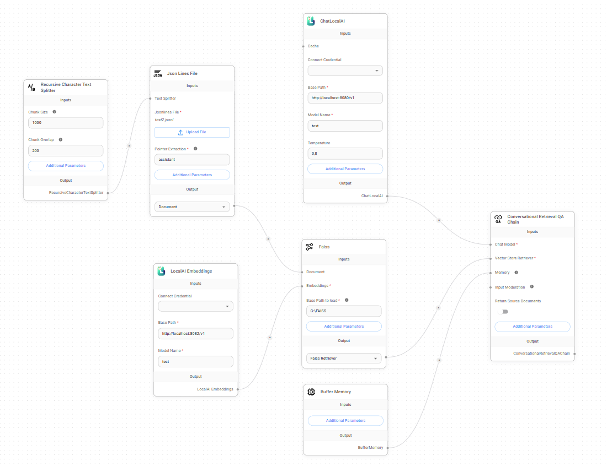
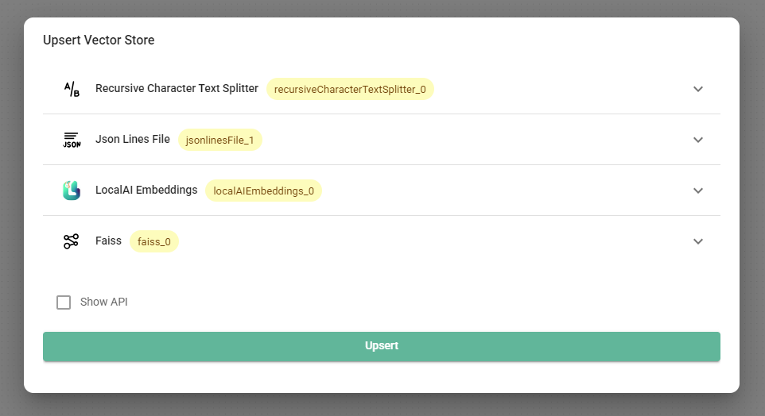
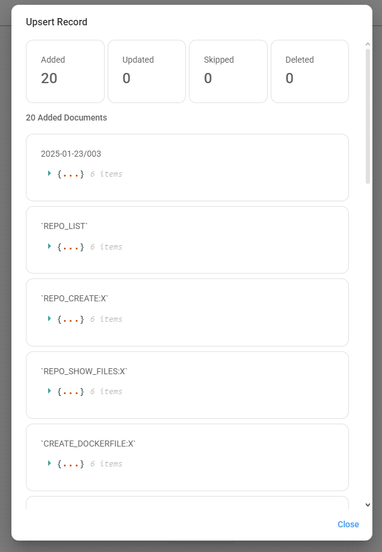
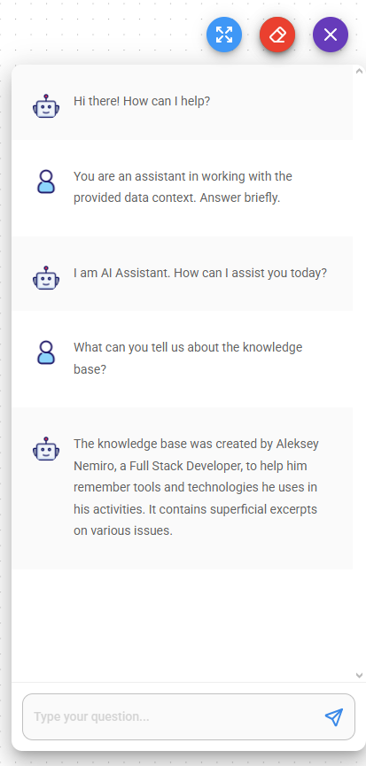

# Flowise

**Flowise** — визуальный конструктор приложений LLM без написания кода.

* [https://flowiseai.com/](https://flowiseai.com/)
* [https://github.com/FlowiseAI/Flowise](https://github.com/FlowiseAI/Flowise)

## Как внедрить собственные данные в LLM?

Внедрение данных — это предоставление доступа к данным через контекст модели.

Это простой способ обучения больших языковых моделей, который не требуется серьезных технических ресурсов.

*Если что-то не понятно, попробуйте взглянуть на скриншоты внизу страницы.*

:::note
Информация актуальна для **Flowise v2.2.4**.
:::

1. Откройте раздел **Chatflows** и нажмите **Create**.
2. Выберите **LangChain** в качестве набора компонентов.
3. Добавьте **Conversational Retrieval QA Chain**.
4. Добавьте любой загрузчик документов - **Documents Loader**. Например,
   * **Text File** для текстовых файлов:
     * Загрузите любой текстовой файл, данные которого будут внедрены в контекст.
   * **Json Lines File** для файлов `.jsonl`:
     * Загрузите [набор данных](datasets) в формате JSON Lines.
     * Укажите в параметре **Pointer Extractor** имя поля в JSON, которое содержит ответ помощника.
   * и т.д.
5. Добавьте **Text Splitter**. Например,
   * **Markdown Text Splitter** для файлов в формате markdown;
   * **Recursive Character Text Splitter** для файлов в формате JSON Lines;
   * и т.д.
6. Соедините **Text Splitter** и **Documents Loader**.
7. Добавьте **LocalAI Embeddings** - это позволит интегрировать данные в модель:
   * В параметре **Base Path** укажите URL к серверу *внедрения* (embedding server). Например, при использовании [llama.cpp](llama-cpp):
     * Если запущен llama-server в режиме внедрения: `llama-server.exe -m "C:\models\Meta-Llama-3.1-8B-Instruct-Q8_0.gguf" --embedding --pooling mean --port 8082 --verbose`, то в таком случае, в параметре **Base Path** должен быть адрес `http://localhost:8082/v1`.
   * Укажите любое имя модели в параметре **Model Name**. Например, `test`.
8. Добавьте любой **Vector Store**:
   * **In-Memory Vector Store** - самый простой вариант для первой пробы.
   * **Faiss** - локальная векторная база от Facebook, ничего сложного, главное установить правильную версию:
     * В параметре **Base path to load** укажите путь папке хранилища.
9. Соедините **Documents Loader** и **Embedding** с **Vector Store**.
10. Добавьте **ChatLocalAI** - это позволит использовать локальные LLM:
   * В папаметр **Base Path** укажите URL сервера *воспроизведения* (inference server). Используйте модель аналогичную модели серера внедрения. Например, при использовании [llama.cpp](llama-cpp):
     * Если llama-server запущен со следующими параметрами: `llama-server.exe -m "C:\models\Meta-Llama-3.1-8B-Instruct-Q8_0.gguf" --port 8080 --verbose`, то в параметр  **Base Path** следует указать адрес `http://localhost:8080/v1`.
   * Укажите в параметр **Model Name** имя модели аналогичное имени указанному в узле **LocalAI Embeddings**.
11. Соедините **ChatLocalAI** и **Vector Store** с **Conversational Retrieval QA Chain**.
12. Сохранить рабочий процесс чата.  
    
13. Убедитесь, что сервера внедрения (embedding server) и воспроизведения (inference server) запущены.
14. Нажмите на кнопку **Upsert Vector Database**. Дождитесь завершения внедрения.  
    Процесс внедрения может занять длительное время, в зависимости от размера набора данных и производительности компьютера.  
      
    
15. Запустите новый чат чтобы проверить, как это работает.  
    Хорошей практикой является указание подсказки для введения модели в контекст.
    
16. Наслаждайтесь!
