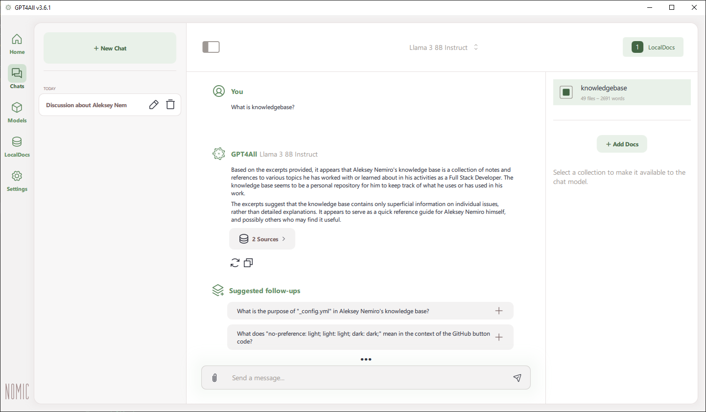

---
tags:
  - GPT4All
  - LLM
  - Machine Learning
  - AI
  - Большие языковые модели
  - ИИ
---

# GPT4All

**GPT4All** — приложение для локального использования больших языковых моделей (LLM).

* [https://www.nomic.ai/gpt4all](https://www.nomic.ai/gpt4all)
* [https://github.com/nomic-ai/gpt4all](https://github.com/nomic-ai/gpt4all)

:::note
Информация актуальна для **GPT4All v3.6.1**.
:::

## Быстрый старт

1. Скачайте и установите приложение.
2. Откройте вкладку **Models** => найдите и загрузите подходящие для вашего оборудования модели. Например, **Llama 3**.
3. Откройте вкладку **LocalDocs**  и нажмите **Add collection**. Выберите файлы для создания коллекции. Дождитесь завершения индексации.
4. Откройте вкладку **Chats** и начните новый чат.
5. Выберите модель.
6. Нажмите **LocalDocs** и выберите созданную коллекцию.
7. Наслаждайтесь общением!

## Решение проблем

### Error 0xc0000005

Если возникла ошибка `0xc0000005`, вам необходимо сделать следующее:

* [x] Убедитесь, что ваш процессор поддерживает **AVX**.
* [x] Проверьте настройки приложения. Попробуйте выбрать другое устройство.
