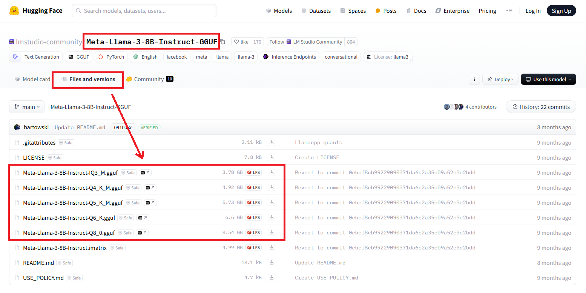
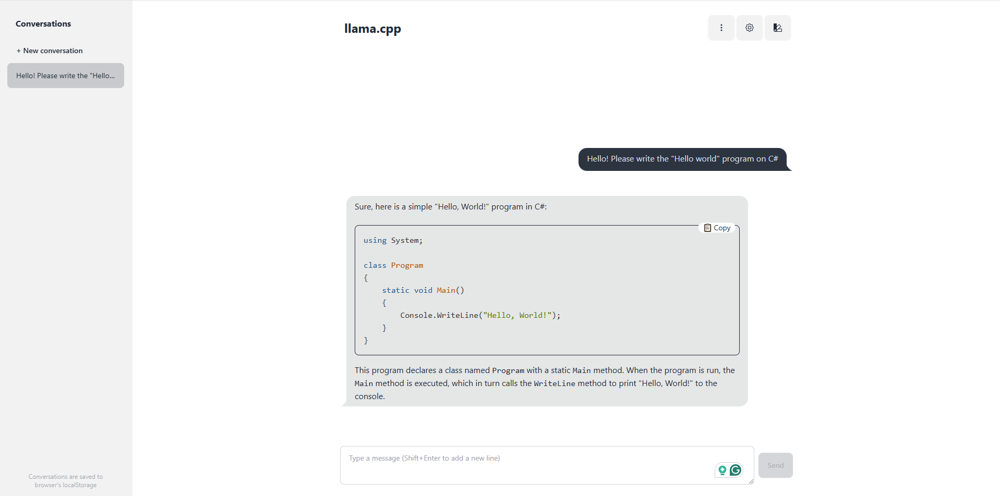
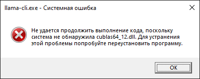

# llama.cpp

Open source software library that performs inference on various large language models such as Llama.

The library uses the GGUF (GGML Universal File) binary file format to store tensors and model metadata.

[https://github.com/ggerganov/llama.cpp](https://github.com/ggerganov/llama.cpp)

## Get started

1. Download the latest release: https://github.com/ggerganov/llama.cpp/releases
   For example, for Windows with GPU: **llama-b4458-bin-win-cuda-cu12.4-x64.zip** + **cudart-llama-bin-win-cu12.4-x64.zip**.

2. Extract files. If you downloaded **cudart**, place the dll files in the **llama.cpp** folder.

3. Find and download the guff files of LLM(s): [https://huggingface.co/models?search=gguf](https://huggingface.co/models?search=gguf).  
   For example, [https://huggingface.co/lmstudio-community/Meta-Llama-3-8B-Instruct-GGUF/tree/main](https://huggingface.co/lmstudio-community/Meta-Llama-3-8B-Instruct-GGUF/tree/main):
   

4. Launch command prompt and run the following command:

   ```bash
   llama-cli -m model.gguf -p "You are a helpful assistant" -cnv
   ```

5. Enjoy!

## llama-server

The library lets you set up your server with a web interface. It's very easy:

```bash
llama-server -m "C:\models\Codestral-22B-v0.1-Q4_K_M.gguf" --port 8080
```



### Multiple users

For example `4` users with `4096 x 4 = 16 384` max context size:

```bash
llama-server -m phi-4-Q4_K_M.gguf -c 16384 -np 4 --port 8080
```

## Troubleshooting

### Error: File cublas64_12.dll not found

[Download the required files](https://github.com/ggerganov/llama.cpp/releases) and copy them to the **llama.cpp** folder.


