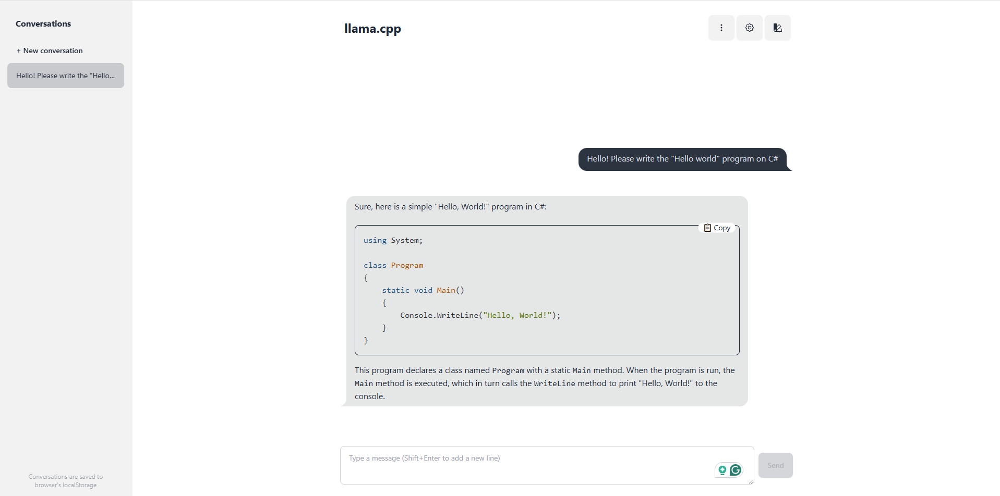

# llama-server

The library lets you set up your server with a web interface. It's very easy:

```bash
llama-server -m "C:\models\Codestral-22B-v0.1-Q4_K_M.gguf" --port 8080
```



## Multiple users

For example `4` users with `4096 x 4 = 16 384` max context size:

```bash
llama-server -m phi-4-Q4_K_M.gguf -c 16384 -np 4 --port 8080
```

## Embedding

Embedding vectorizes custom content for later use in models (RAG).

The following command shows how to start the server in embedding mode:

```bash
llama-server -m "C:\models\phi-4-Q4_K_M.gguf" --embedding --pooling cls --ubatch-size 8192
```

* `--pooling` - pooling type for embeddings:
  * none - without pooling;
  * mean - averaging of vector representations, this type is used most often;
  * cls - a special token that is added to the beginning of each word for classification. Used in BERT and derived models. Optimal for QA (questions-answers) tasks;
  * last - uses a vector representation of the last token or word from a sequence;
  * rank - a method of ranking or selecting based on certain criteria.
* `--ubatch-size` - maximum packet size in bytes (default: `512`). The optimal value is selected experimentally.
