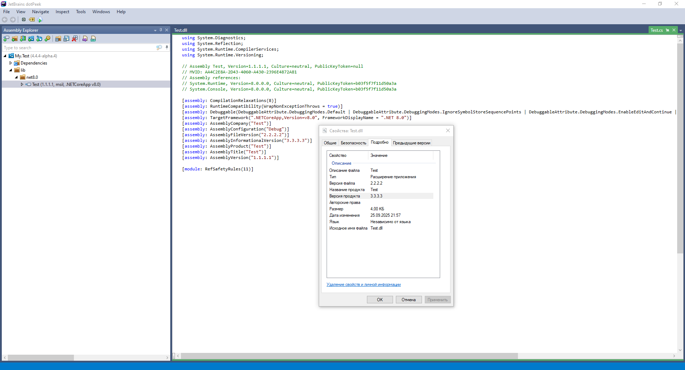

# Номера версий

## Чем отличаются AssemblyVersion, FileVersion, Version и PackageVersion?

* `AssemblyVersion` — версия сборки (.dll, .exe). Является важным значением для внутренних процессов **.NET**.
* `FileVersion` — версия файла (отображается в свойствах файла в проводнике Windows).
* `Version` — версия проекта. Используется в качестве значений для `AssemblyVersion` и `FileVersion`, если они не указаны.
* `PackageVersion` — версия NuGet-пакета.

```xml
<Project Sdk="Microsoft.NET.Sdk">
  <PropertyGroup>
    <TargetFramework>net8.0</TargetFramework>
    <AssemblyVersion>1.1.1.1</AssemblyVersion>
    <FileVersion>2.2.2.2</FileVersion>
    <Version>3.3.3.3</Version>
    <PackageVersion>4.4.4-alpha.4</PackageVersion>
    <PackageId>My.Test</PackageId>
    <GeneratePackageOnBuild>true</GeneratePackageOnBuild>
  </PropertyGroup>
</Project>
```

[](assets/version.png)

## Как указать номер версии?

В большинстве случаев, я предпочитаю указывать каждый сегмент номера версии отдельно и потом собирать из этих частей финальный номер для разных случаев.

Это позволяет делать отдельный номер версии файла (`Version`/`FileVersion`) в стандартном формате `1.0.0.0`, номер версии пакета (`PackageVersion`) в формате [SemVer](/it/development/versioning) — `1.0.0-beta.1`. Отдельно можно сформировать номер версии сборки `AssemblyVersion`.

```xml
<Project>
  <PropertyGroup>
    <MajorVersionNumber>1</MajorVersionNumber>
    <MinorVersionNumber>0</MinorVersionNumber>
    <PatchVersionNumber>0</PatchVersionNumber>
    <BuildVersionNumber>0</BuildVersionNumber>
    <SuffixVersionNumber>-beta.1</SuffixVersionNumber>
    <PackageVersion>$(MajorVersionNumber).$(MinorVersionNumber).$(PatchVersionNumber)$(SuffixVersionNumber)</PackageVersion>
    <Version>$(MajorVersionNumber).$(MinorVersionNumber).$(PatchVersionNumber).$(BuildVersionNumber)</Version>
    <AssemblyVersion>$(BuildVersionNumber)</AssemblyVersion>
  </PropertyGroup>
</Project>
```

## Как включить метаданные из git в номер версии?

Следующий пример включает хеш и дату последней фиксации, а также имя ветки в формате: `9b1c2eed78afc24989fb2fdbd97a2d770b384168;2025-09-24T22:58:29+03:00;HEAD -> master`.

```xml
<Target Name="SetSourceRevisionId" BeforeTargets="InitializeSourceControlInformation">
  <Exec Condition=" '$(OS)' == 'Windows_NT' " Command="git log -1 --pretty=%%H;%%aI;%%D" ConsoleToMSBuild="True" IgnoreExitCode="False">
    <Output PropertyName="SourceRevisionId" TaskParameter="ConsoleOutput" />
  </Exec>
  <Exec Condition=" '$(OS)' == 'Unix' " Command="git log -1 --pretty='%H;%aI;%D'" ConsoleToMSBuild="True" IgnoreExitCode="False">
    <Output PropertyName="SourceRevisionId" TaskParameter="ConsoleOutput" />
  </Exec>
</Target>
```

:::note
Свойство `$(SourceRevisionId)` будет автоматически добавляться к номеру версии при условии, что это поведение не отключено с помощью параметра `IncludeSourceRevisionInInformationalVersion`.
:::
