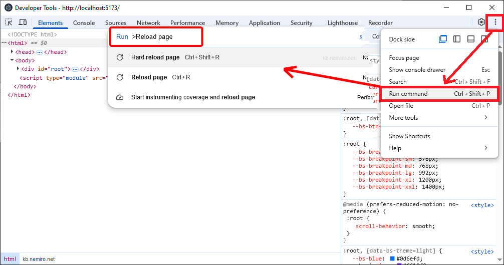

# Отладка

## Как открыть инструменты разработчика (DevTools)?

Чтобы открыть инструменты разработчика в приложении **Electron** необходимо нажать в окне приложения клавишу `F12` или сочетание клавиш `Ctrl + Shift + I`.

## Как перезагрузить приложение/страницу?

* `Ctrl + R` - обычная перезагрузка
* `Ctrl + Shift + R` - жесткая перезагрузка

## Как выполнить любую команду в инструментах разработчика?

Три точки => Run command (`Ctrl + Shift + P`).

В появившемся окне ввести имя команды, которую необходимо выполнить.



## Как настроить отладку в VS Code для electron-vite?

```json title="./vscode/launch.json"
{
  "version": "0.2.0",
  "configurations": [
    {
      "name": "Debug Main Process",
      "type": "node",
      "request": "launch",
      "cwd": "${workspaceRoot}",
      "runtimeExecutable": "${workspaceRoot}/node_modules/.bin/electron-vite",
      "windows": {
        "runtimeExecutable": "${workspaceRoot}/node_modules/.bin/electron-vite.cmd"
      },
      "runtimeArgs": ["--sourcemap"],
      "env": {
        "REMOTE_DEBUGGING_PORT": "9222"
      }
    },
    {
      "name": "Debug Renderer Process",
      "port": 9222,
      "request": "attach",
      "type": "chrome",
      "webRoot": "${workspaceFolder}/src/renderer",
      "timeout": 60000,
      "presentation": {
        "hidden": true
      }
    }
  ],
  "compounds": [
    {
      "name": "Debug All",
      "configurations": ["Debug Main Process", "Debug Renderer Process"],
      "presentation": {
        "order": 1
      }
    }
  ]
}
```
