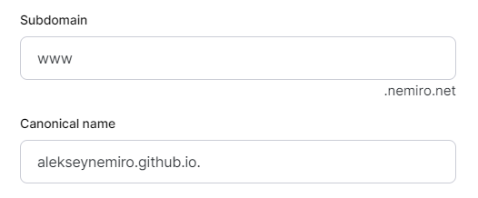
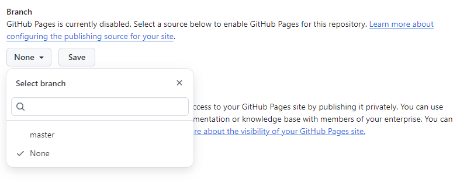
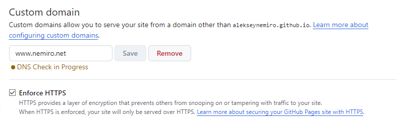

---
tags:
  - GitHub Pages
  - GitHub
---

# GitHub Pages

## How to use a custom domain?

1. Configure DNS at the DNS hosting level:
   * Create `A` records. Use `@` or empty string. Check [actual lists of IPs](https://docs.github.com/ru/pages/configuring-a-custom-domain-for-your-github-pages-site/managing-a-custom-domain-for-your-github-pages-site#configuring-an-apex-domain).

    ```plain
    185.199.108.153
    185.199.109.153
    185.199.110.153
    185.199.111.153
    ```

    

    * Create `CNAME` record to `username.github.io`.

    

2. Open repository Settings => Pages
   * Select Branch.
     
   * Add `CNAME` to "Custom domain" section and Save.
   * Wait for checking results.
   * Set the "Enforce HTTPS" option when it becomes available.
     
   * If the domain is down for a long time (several hours), try removing it from GitHub and set it again.
