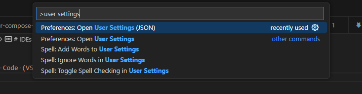

# User settings (JSON)

## How to open a settings file in JSON format?

`Ctrl + Shift + P` => Preferences: Open User Settings (JSON)



## How to enable/disable autosave?

```json
"files.autoSave": "onFocusChange",
```

## How to set newline character?

```json
"files.eol": "\n",
```

## How to enable the removal of trailing spaces?

```json
"files.trimTrailingWhitespace": true,
```

## How to prevent trailing spaces from being removed for Markdown files?

```json
"[markdown]": {
    "files.trimTrailingWhitespace": false
},
```
