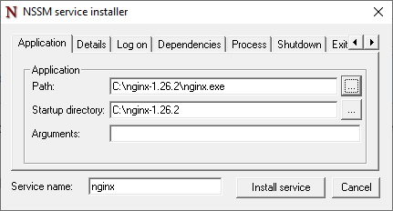

# Установка NGINX в Windows в качестве службы/сервиса

1. [Скачайте NGINX](https://nginx.org/en/download.html)
2. `choco install nssm`
3. `nssm install nginx`
4. 
5. Наслаждайтесь!

## Как перезапустить сервис?

```bash
net stop nginx && net start nginx
```
