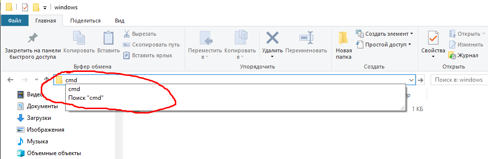
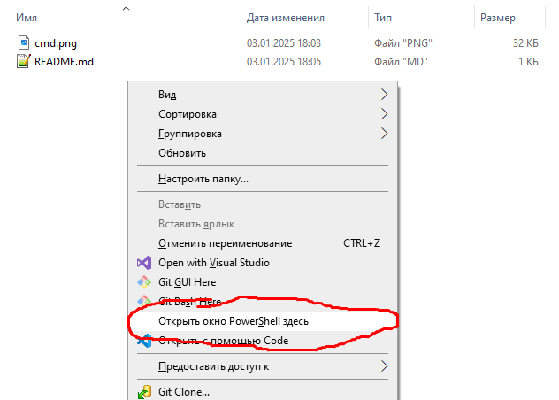

# Windows Command Prompt

## Как открыть командную строку в любой папке?

Просто введите `cmd` в адресной строке проводника:



Если удерживать клавишу `Shift` и щелкнуть правой кнопкой мыши в любом месте, вы сможете запустить **PowerShell**:



## Как установить переменную окружения? (только для текущей сессии)

```bash
set VAR_NAME=VALUE
```

## Как получить имя хоста текущей машины?

```bash
hostname
```

## Как создать символьную ссылку?

```bash title="Синтаксис"
mklink LINK_PATH TARGET_PATH
```

```bash title="Пример"
mklink  "C:\Program Files\nodejs" "C:\nvm\v18.16.0" 
```

## Как посмотреть текущий кэш DNS?

```bash title="Просмотр кэша"
ipconfig /displaydns
```

```bash title="Очистить кэш"
ipconfig /flushdns
```

## Как найти все подстроки в выводе команды?

```
dir | findstr git
```

## Как запустить журнал событий Windows?

```bash
eventvwr
```

## Как проверить занят определенный порт или нет?

```bash
netstat -na | find "8080"
```

## Как перезапустить службу?

```bash
net stop nginx && net start nginx
```
