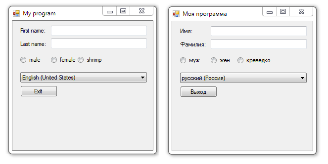

# Localizing Windows Forms

Example of use standard localization tools of **Windows Forms**.

## Target

https://www.youtube.com/watch?v=oevqEXCyg3s

## Requirements

* Visual Studio 2010 or later
* .NET Framework 4.0

## Tags 

CSharp, C#, Windows Forms, Localization, Settings

## Release

2013-03-15

## License

The MIT License (MIT)

Copyright © 2013, Aleksey Nemiro