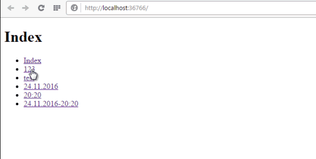

# Special characters in the routes

The example shows the use of dots and colons in the routes.

## Target

https://toster.ru/q/374113

## Requirements

* Visual Studio 2010 or later
* .NET Framework 4.0

## Tags 

CSharp, C#, ASP.NET, ASP.NET MVC, Routes, web.config

## Release

2016-11-24

## License

The MIT License (MIT)

Copyright © 2016, Aleksey Nemiro