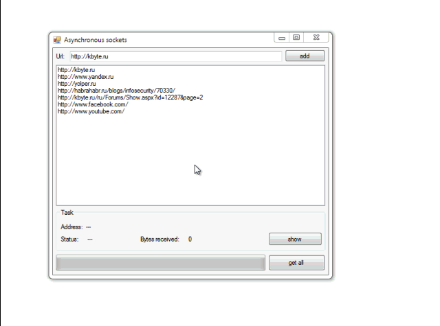

# Asynchronous sockets

Example of using asynchronous sockets to perform HTTP-requests.

## Target

http://kbyte.ru/ru/Forums/Show.aspx?id=12287

## Requirements

* Visual Studio 2010 or later
* .NET Framework 4.0

## Tags 

CSharp, C#, Windows Forms, System.Net.Sockets, Sockets, Async, HTTP

## Release

2011-10-28

## License

The MIT License (MIT)

Copyright © 2011, Aleksey Nemiro