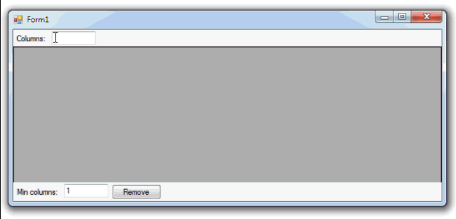

# DataGridView dynamic columns

Example of adding and removing columns in a **DataGridView**.

## Target

http://kbyte.ru/ru/Forums/Show.aspx?id=17354

## Requirements

* Visual Studio 2010 or later
* .NET Framework 4.0

## Tags 

CSharp, C#, Windows Forms, DataGridView, Controls

## Release

2015-03-12

## License

The MIT License (MIT)

Copyright © 2015, Aleksey Nemiro