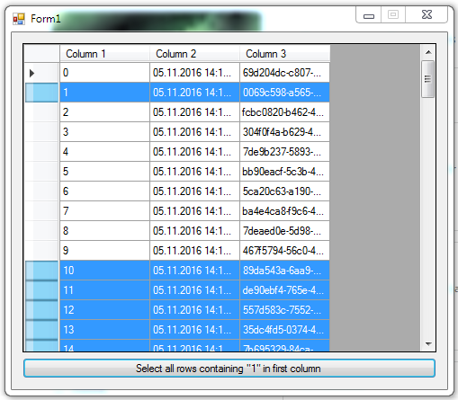

# DataGridView select rows

The example shows the selection of certain rows in a **DataGridView**.

## Target

http://kbyte.ru/ru/Forums/Show.aspx?id=16361

## Requirements

* Visual Studio 2010 or later
* .NET Framework 4.0

## Tags 

CSharp, C#, Windows Forms, DataGridView

## Release

2014-03-18

## License

The MIT License (MIT)

Copyright © 2014, Aleksey Nemiro