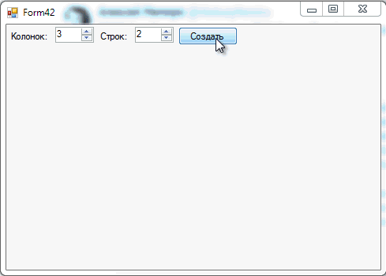

# Create TableLayoutPanel programmatically

Small example that shows how to create a **TableLayoutPanel** with **C#**.

## Target

https://toster.ru/q/367716

## Requirements

* Visual Studio 2015 or later
* .NET Framework 4.6

## Tags 

CSharp, C#, Windows Forms, TableLayoutPanel, Dynamic, Controls

## Release

2016-11-03

## License

The MIT License (MIT)

Copyright © 2016, Aleksey Nemiro