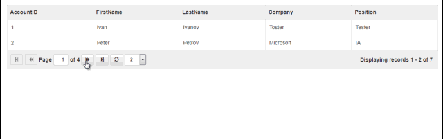

# jQuery Grid Bootstrap

Example of using jQuery Grid Bootstrap in ASP.NET MVC.

## Target

https://toster.ru/q/369366

## Requirements

* Visual Studio 2015 or later
* .NET Framework 4.0
* SQL Server 2014

## Tags 

CSharp, C#, ASP.NET, ASP.NET MVC, Database, SQL Server, AJAX, jQuery Grid Bootstrap, Data

## Release

2016-11-09

## License

The MIT License (MIT)

Copyright © 2016, Aleksey Nemiro