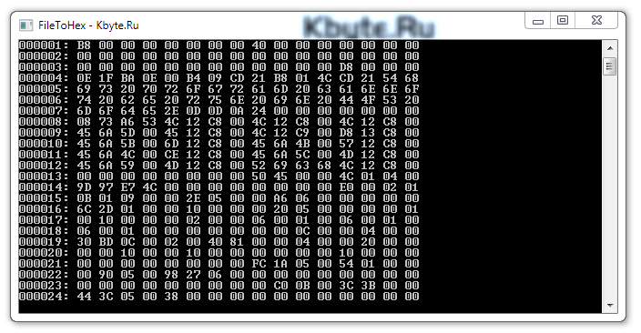

# File to HEX

The example shows reading the file and displays its contents in hexadecimal.

## Target

http://kbyte.ru/ru/Forums/Show.aspx?id=17134

## Requirements

* Visual Studio 2010 or later
* .NET Framework 4.0

## Tags

CSharp, C#, Console, File, HEX

## Release

2014-12-02

## License

The MIT License (MIT)

Copyright © 2014, Aleksey Nemiro