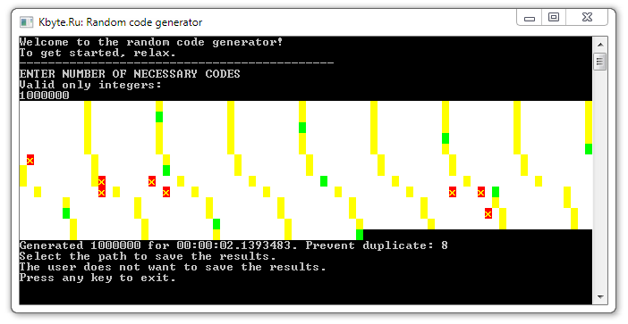

# Unique random codes

The example shows how to quickly generate a large number of unique codes.

## Target

http://kbyte.ru/ru/Forums/Show.aspx?id=16261

## Requirements

* Visual Studio 2010 or later
* .NET Framework 4.0

## Tags 

Visual Basic .NET, VB.NET, Console, Unique, Random

## Release

2014-02-19

## License

The MIT License (MIT)

Copyright © 2014, Aleksey Nemiro