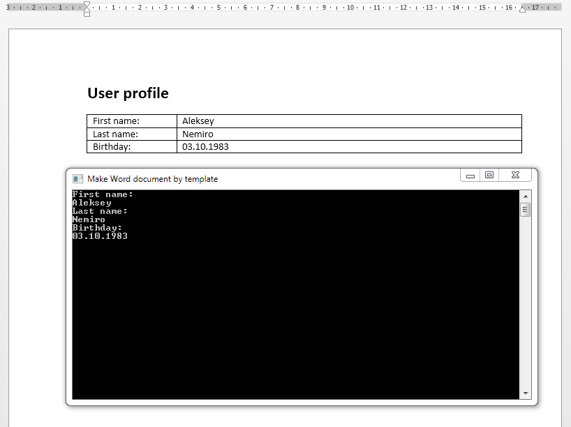

# Making Word document by HTML template

The easiest way to create **MS Word** document.
The document is created based on the **HTML** template.

## Target

http://kbyte.ru/ru/Forums/Show.aspx?id=14831

## Requirements

* Visual Studio 2010 or later
* .NET Framework 3.5

## Tags 

Visual Basic .NET, VB.NET, Console, Word, MS Word, HTML Template, MS Office

## Release

2013-07-10

## License

The MIT License (MIT)

Copyright © 2013, Aleksey Nemiro