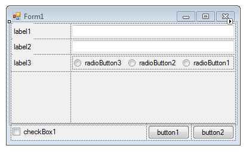

# LayoutExample

Example of use **FlowLayoutPanel** and **TableLayoutPanel** to align the form elements.

## Target

https://www.youtube.com/watch?v=3Oma-JnirU8

## Requirements

* Visual Studio 2010 or later
* .NET Framework 4.0

## Tags 

CSharp, C#, Windows Forms, TableLayoutPanel, FlowLayoutPanel, Layout, Design, User Interface, Controls

## Release

2013-03-21

## License

The MIT License (MIT)

Copyright © 2013, Aleksey Nemiro