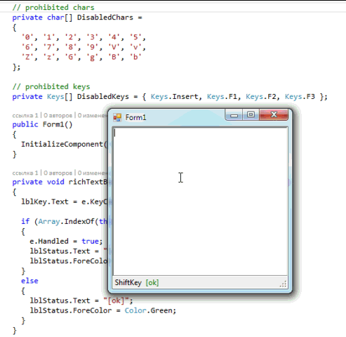

# Lock keystrokes in a RichTextBox

The example shows how to capture keystrokes in a **RichTextBox** or deny entry of certain characters.

## Target

https://toster.ru/q/294409

## Requirements

* Visual Studio 2013 or later
* .NET Framework 4.0

## Tags 

CSharp, C#, Windows Forms, RichTextBox, Keyboard, KeyPress, KeyDown

## Release

2016-02-20

## License

The MIT License (MIT)

Copyright © 2016, Aleksey Nemiro