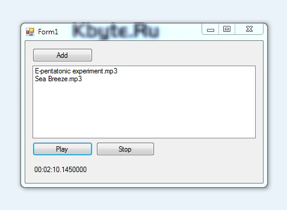

# Usage AxWindowsMediaPlayer

Play music files in **Visual Basic .NET** using **AxWindowsMediaPlayer**.

## Target

http://kbyte.ru/ru/Forums/Show.aspx?id=16457

## Requirements

* Visual Studio 2010 or later
* .NET Framework 4.0

## Tags 

VB.NET, Visual Basic .NET, Windows Forms, MediaPlayer, AxWindowsMediaPlayer, mp3, music

## Release

2014-04-19

## License

The MIT License (MIT)

Copyright © 2014, Aleksey Nemiro