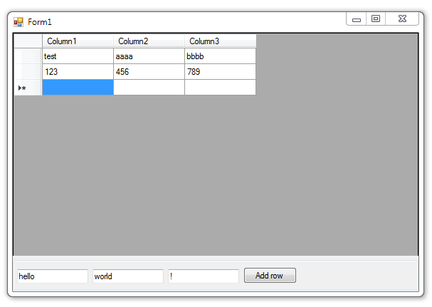

# Добавление строк в DataGridView

Это простой пример программного добавления новых строк в **DataGridView**.

## Назначение

http://kbyte.ru/ru/Forums/Show.aspx?id=16428

## Требования

* Visual Studio 2010 или новее
* .NET Framework 4.0

## Ключевые слова

VB.NET, Visual Basic .NET, Windows Forms, DataGridView

## Выпуск

2014-03-28

## Лицензия

The MIT License (MIT)

Copyright © 2014, Aleksey Nemiro