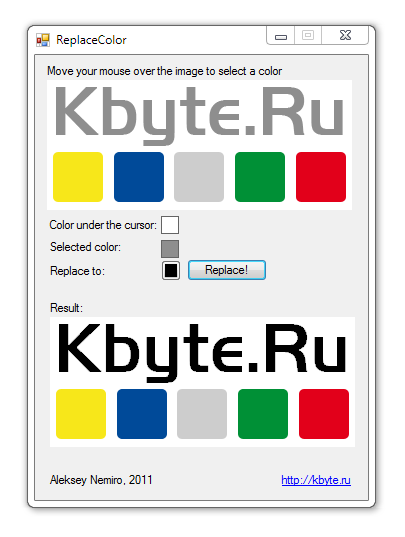

# Replacing colors

This example demonstrates the replacement of the selected color to another.

## Target

http://kbyte.ru

## Requirements

* Visual Studio 2010 or later
* .NET Framework 3.5

## Tags 

VB.NET, Visual Basic .NET, Windows Forms, Color, Graphics, GDI+, System.Drawing

## Release

2011-01-08

## License

The MIT License (MIT)

Copyright © 2011, Aleksey Nemiro