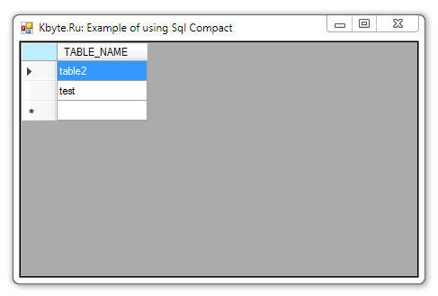

# Using SQL Server Compact

Simple example of getting data from a database **SQL Server Compact** and outputing to the **DataGridView**.

## Target

http://kbyte.ru/ru/Forums/Show.aspx?id=16497

## Requirements

* Visual Studio 2010 or later
* .NET Framework 4.0

## Tags 

VB.NET, Visual Basic .NET, Windows Forms, SQL Server Compact, Database, DataGridView, System.Data, System.Data.SqlServerCe

## Release

2014-05-12

## License

The MIT License (MIT)

Copyright © 2014, Aleksey Nemiro