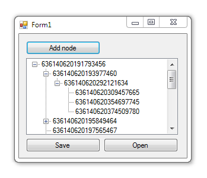

# Saving and restoring TreeView

aving data from the **TreeView** to a file and restore them using **BinaryFormatter**.

## Target

http://kbyte.ru/ru/Forums/Show.aspx?id=15143

## Requirements

* Visual Studio 2010 or later
* .NET Framework 3.5

## Tags 

VB.NET, Visual Basic .NET, Windows Forms, TreeView, BinaryFormatter, Controls, Files, Serialization

## Release

2013-08-12

## License

The MIT License (MIT)

Copyright © 2013, Aleksey Nemiro