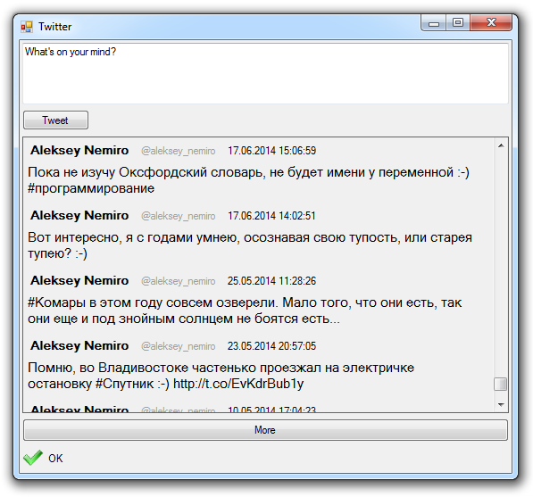

# Twitter application

This application allows you to view and publish tweets.

## Target

http://www.codeproject.com/Articles/875991/Users-Authorization-through-OAuth-in-NET-Framework

## Requirements

* Visual Studio 2013 or later
* .NET Framework 4.0

## Tags 

Visual Basic .NET, VB.NET, Windows Forms, Twitter, Nemiro.OAuth

## Release

2014-12-09

## License

Apache License Version 2.0

Copyright © 2014, Aleksey Nemiro