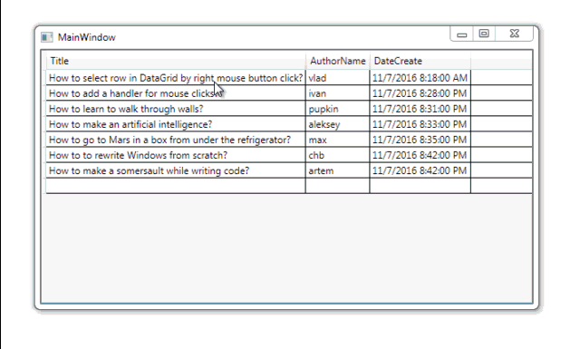

# Select row in DataGrid by click of right mouse button 

Simple example shows how to select a row in **DataGrid** by pressing the right mouse button.

## Target

https://toster.ru/q/368886

## Requirements

* Visual Studio 2015 or later
* .NET Framework 4.6

## Tags 

CSharp, C#, WPF, DataGrid, Mouse

## Release

2016-11-07

## License

The MIT License (MIT)

Copyright © 2016, Aleksey Nemiro