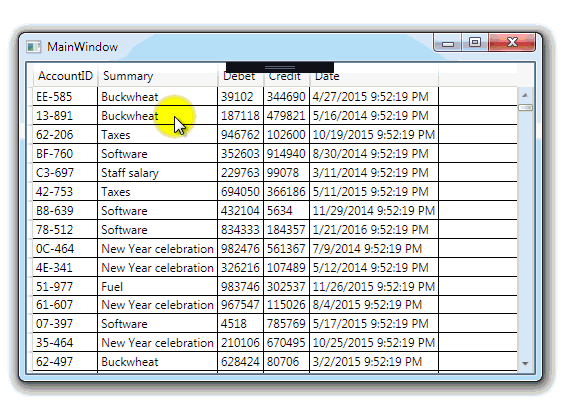

# Sum

The example shows the calculation of the sum of field values of the selected rows in the table.

## Target

https://toster.ru/q/369341

## Requirements

* Visual Studio 2015 or later
* .NET Framework 4.6

## Tags 

CSharp, C#, WPF, DataGrid, Sum, System.Linq

## Release

2016-11-10

## License

The MIT License (MIT)

Copyright © 2016, Aleksey Nemiro