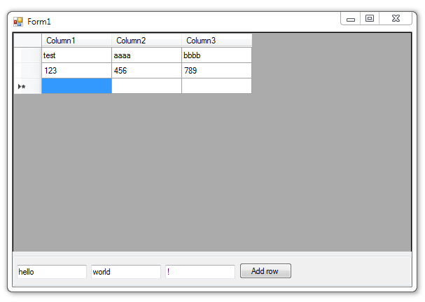

# Adding a new rows to DataGridView

The simplest example of adding new rows in **DataGridView**.

## Target

http://kbyte.ru/ru/Forums/Show.aspx?id=16428

## Requirements

* Visual Studio 2010 or later
* .NET Framework 4.0

## Tags 

VB.NET, Visual Basic .NET, Windows Forms, DataGridView

## Release

2014-03-28

## License

The MIT License (MIT)

Copyright © 2014, Aleksey Nemiro