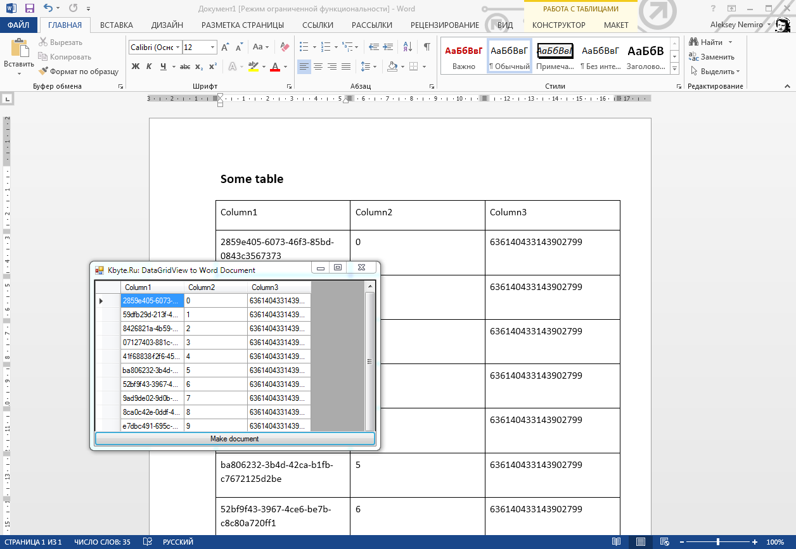

# Making table in Word document

The example shows the creation of a table in a **Word** document on the basis of data **DataGridView**.

## Target

http://kbyte.ru/ru/Forums/Show.aspx?id=17336

## Requirements

* Visual Studio 2010 or later
* .NET Framework 4.0

## Tags 

VB.NET, Visual Basic .NET, Windows Forms, Word, Word.Application, COM, Template, MS Word, MS Office, DataGridView, Table, Microsoft.Office.Interop

## Release

2015-03-10

## License

The MIT License (MIT)

Copyright © 2015, Aleksey Nemiro