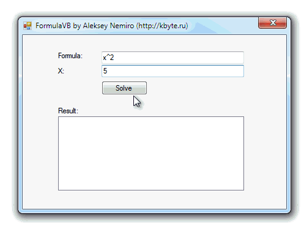

# Math solver

Sample program for solving mathematical equations.

## Target

http://kbyte.ru

## Requirements

* Visual Studio 2010 or later
* .NET Framework 3.5

## Tags 

VB.NET, Visual Basic .NET, Windows Forms, Math, Reflection, CodeDomProvider, System.Reflection, System.CodeDom.Compiler

## Release

2011-04-24

## License

The MIT License (MIT)

Copyright © 2011, Aleksey Nemiro