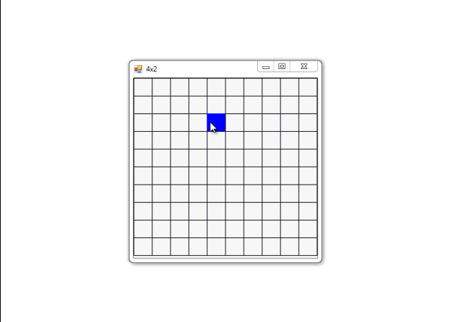

# Drawing cells

Drawing a grid using **DrawRectangle** and **FillRectangle**.

## Target

http://kbyte.ru

## Requirements

* Visual Studio 2010 or later
* .NET Framework 3.5

## Tags 

VB.NET, Visual Basic .NET, Windows Forms, Grid, Graphics, DrawRectangle, FillRectangle, GDI+, System.Drawing

## Release

2012-12-04

## License

The MIT License (MIT)

Copyright © 2012, Aleksey Nemiro