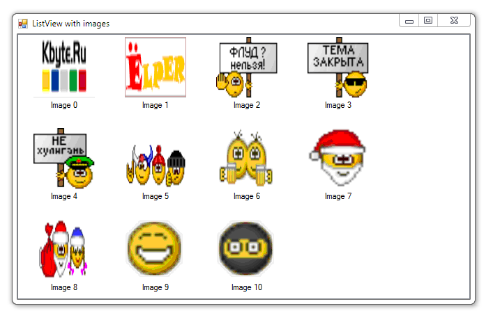

# Images in ListView

Simple example of the show images in a **ListView**.

## Target

http://kbyte.ru

## Requirements

* Visual Studio 2010 or later
* .NET Framework 4.0

## Tags 

VB.NET, Visual Basic .NET, Windows Forms, ListView, Images, Controls

## Release

2011-10-30

## License

The MIT License (MIT)

Copyright © 2011, Aleksey Nemiro