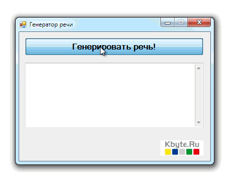

# Generator of random text

Program to generate random text in Russian.

## Target

http://kbyte.ru

## Requirements

* Visual Studio 2008 or later
* .NET Framework 3.5

## Tags 

VB.NET, Visual Basic .NET, Windows Forms, Randomize, Text

## Release

2011-02-23

## License

The MIT License (MIT)

Copyright © 2011, Aleksey Nemiro