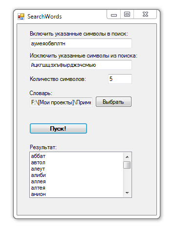

# Search words

Program to search in a dictionary of with a given set of characters.
This is only for the Russian language.

## Target

http://kbyte.ru/ru/Forums/Show.aspx?id=15419

## Requirements

* Visual Studio 2010 or later
* .NET Framework 3.5

## Tags 

VB.NET, Visual Basic .NET, Windows Forms, Text, Text Search

## Release

2013-09-13

## License

The MIT License (MIT)

Copyright © 2013, Aleksey Nemiro