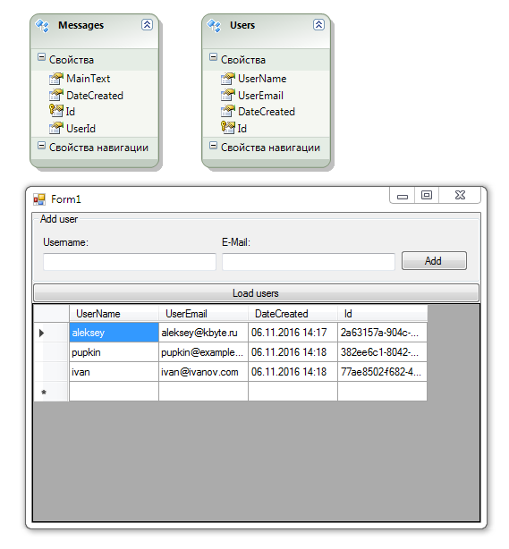

# Using EDM ADO.NET

Simple example using of EDM ADO.NET with **SQL Server Compact**.

## Target

http://kbyte.ru/ru/Forums/Show.aspx?id=16628

## Requirements

* Visual Studio 2010 or later
* .NET Framework 4.0

## Tags 

VB.NET, Visual Basic .NET, Windows Forms, EDM, EMDX, SQL Server Compact, Database, DataGridView, System.Data, System.Data.Entity

## Release

2014-06-10

## License

The MIT License (MIT)

Copyright © 2014, Aleksey Nemiro