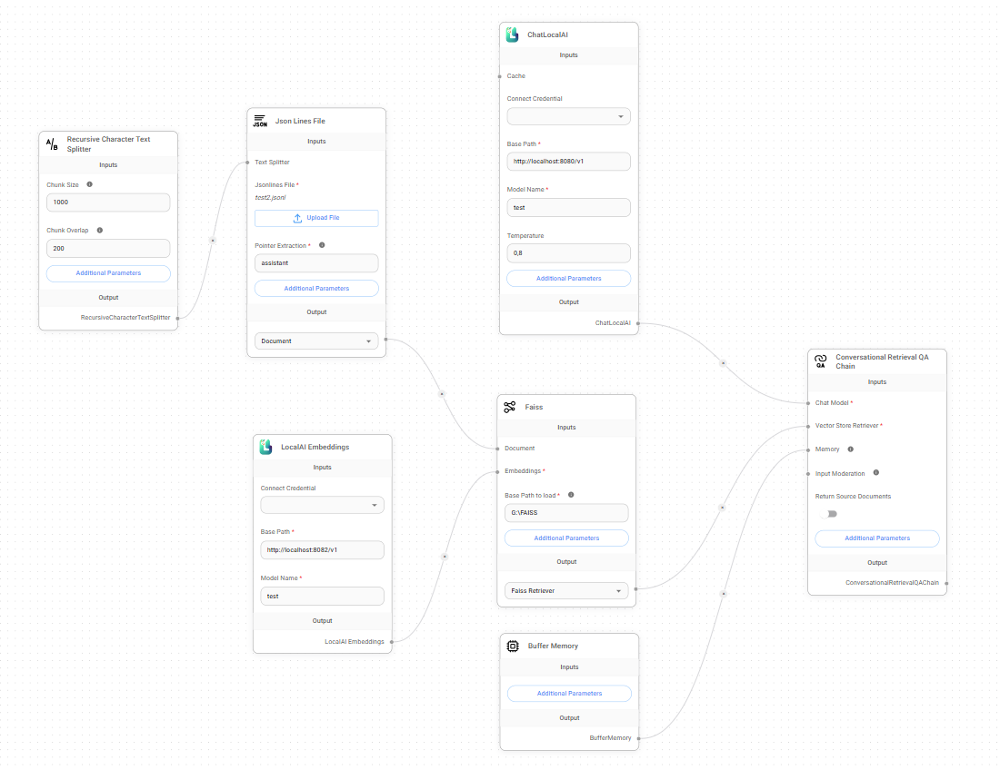
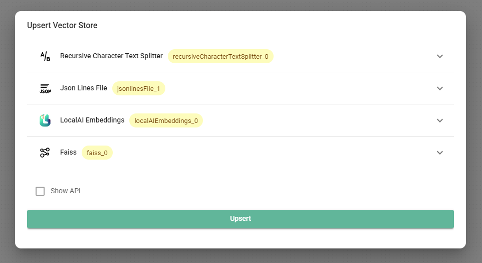
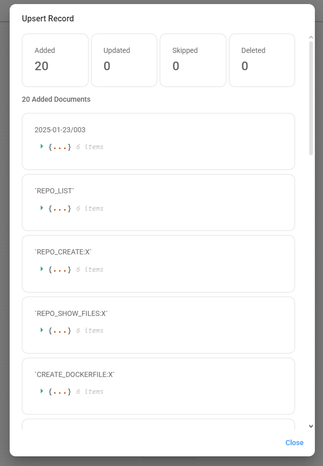
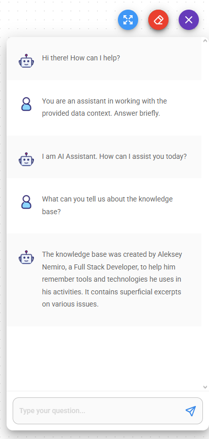

# Flowise

:::warning
This document has been translated using machine translation without human review.
:::

**Flowise** is a no-code visual builder for LLM applications.

* [https://flowiseai.com/](https://flowiseai.com/)
* [https://github.com/FlowiseAI/Flowise](https://github.com/FlowiseAI/Flowise)

## How to embed custom data into an LLM?

Data embedding is providing access to data through the model's context.

This is a simple method for training large language models that does not require significant technical resources.

*If something is unclear, try looking at the screenshots at the bottom of the page.*

:::note
Information is relevant for **Flowise v2.2.4**.
:::

1. Open the **Chatflows** section and click **Create**.
2. Select **LangChain** as the component set.
3. Add a **Conversational Retrieval QA Chain**.
4. Add any document loader - **Documents Loader**. For example,
    * **Text File** for text files:
        * Upload any text file whose data will be embedded into the context.
    * **Json Lines File** for `.jsonl` files:
        * Upload a [dataset](datasets) in JSON Lines format.
        * In the **Pointer Extractor** parameter, specify the name of the field in the JSON that contains the assistant's response.
    * etc.
5. Add a **Text Splitter**. For example,
    * **Markdown Text Splitter** for files in markdown format;
    * **Recursive Character Text Splitter** for files in JSON Lines format;
    * etc.
6. Connect the **Text Splitter** and the **Documents Loader**.
7. Add **LocalAI Embeddings** - this will allow data integration into the model:
    * In the **Base Path** parameter, specify the URL to the *embedding* server. For example, when using [llama.cpp](llama-cpp):
        * If llama-server is running in embedding mode: `llama-server.exe -m "C:\models\Meta-Llama-3.1-8B-Instruct-Q8_0.gguf" --embedding --pooling mean --port 8082 --verbose`, then in this case, the **Base Path** parameter should be the address `http://localhost:8082/v1`.
    * Specify any model name in the **Model Name** parameter. For example, `test`.
8. Add any **Vector Store**:
    * **In-Memory Vector Store** - the simplest option for a first try.
    * **Faiss** - a local vector database from Facebook, nothing complicated, the main thing is to install the correct version:
        * In the **Base path to load** parameter, specify the path to the storage folder.
9. Connect the **Documents Loader** and the **Embedding** to the **Vector Store**.
10. Add **ChatLocalAI** - this will allow the use of local LLMs:
    * In the **Base Path** parameter, specify the URL of the *inference* server. Use a model similar to the embedding server model. For example, when using [llama.cpp](llama-cpp):
        * If llama-server is started with the following parameters: `llama-server.exe -m "C:\models\Meta-Llama-3.1-8B-Instruct-Q8_0.gguf" --port 8080 --verbose`, then the **Base Path** parameter should be set to the address `http://localhost:8080/v1`.
    * In the **Model Name** parameter, specify a model name similar to the one specified in the **LocalAI Embeddings** node.
11. Connect **ChatLocalAI** and the **Vector Store** to the **Conversational Retrieval QA Chain**.
12. Save the chat workflow.  
    
13. Make sure the embedding server and inference server are running.
14. Click the **Upsert Vector Database** button. Wait for the embedding to complete.  
    The embedding process may take a long time, depending on the size of the dataset and computer performance.  
      
    
15. Start a new chat to test how it works.  
    A good practice is to provide a prompt to introduce the model to the context.
    
16. Enjoy!
