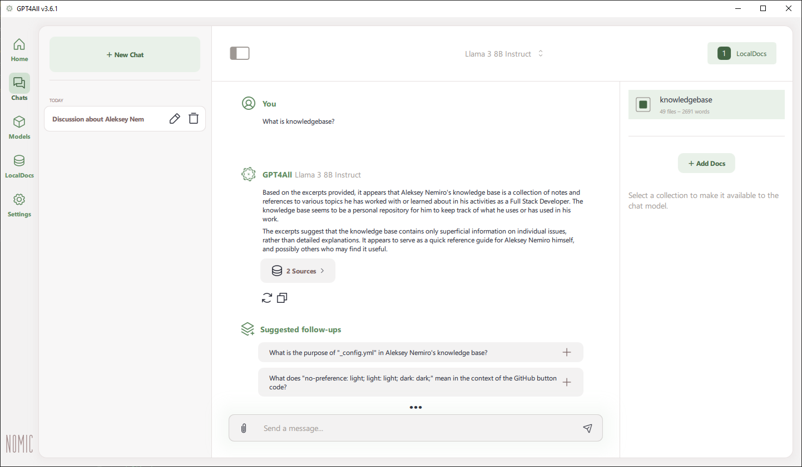

---
tags:
  - GPT4All
  - LLM
  - Machine Learning
  - AI
---

# GPT4All

:::warning
This document has been translated using machine translation without human review.
:::

**GPT4All** is an application for local use of large language models (LLM).

* [https://www.nomic.ai/gpt4all](https://www.nomic.ai/gpt4all)
* [https://github.com/nomic-ai/gpt4all](https://github.com/nomic-ai/gpt4all)

:::note
Information is current for **GPT4All v3.6.1**.
:::

## Quick Start

1. Download and install the application.
2. Open the **Models** tab => find and download models suitable for your hardware. For example, **Llama 3**.
3. Open the **LocalDocs** tab and click **Add collection**. Select files to create a collection. Wait for indexing to complete.
4. Open the **Chats** tab and start a new chat.
5. Select a model.
6. Click **LocalDocs** and select the created collection.
7. Enjoy the conversation!

## Troubleshooting

### Error 0xc0000005

If you encounter the error `0xc0000005`, you need to do the following:

* [x] Make sure your processor supports **AVX**.
* [x] Check the application settings. Try selecting a different device.
