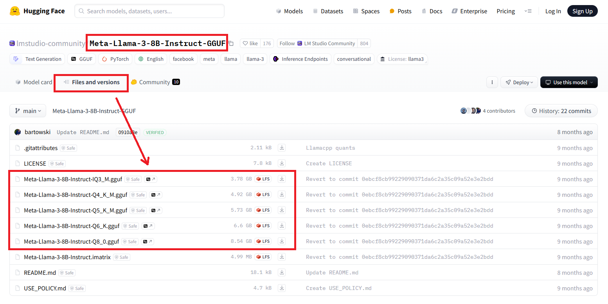

# llama.cpp: Quick Start

:::warning
This document has been translated using machine translation without human review.
:::

1. Download the latest version of **llama.cpp** for your platform: https://github.com/ggerganov/llama.cpp/releases
   For example, for **Windows** with **GPU** support, you need to download: **llama-b4458-bin-win-cuda-cu12.4-x64.zip** + **cudart-llama-bin-win-cu12.4-x64.zip**.

2. Extract the files from the downloaded archives. If you downloaded the **cudart** files, place the **dll** files in the folder with the unpacked **llama.cpp** files.

3. Find and download model files (LLM) in the **guff** format: [https://huggingface.co/models?search=gguf](https://huggingface.co/models?search=gguf).  
   For example, [https://huggingface.co/lmstudio-community/Meta-Llama-3-8B-Instruct-GGUF/tree/main](https://huggingface.co/lmstudio-community/Meta-Llama-3-8B-Instruct-GGUF/tree/main):
   

4. Launch the command line in the **llama.cpp** folder and run the following command:

   ```bash
   llama-cli -m model.gguf -p "You are a smart assistant. Help with whatever you can." -cnv
   ```

5. Enjoy!
