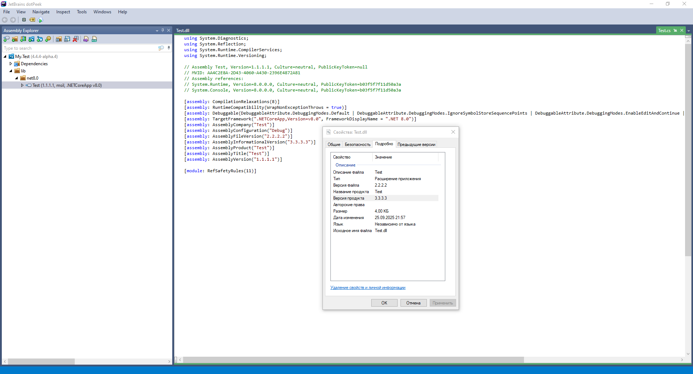

# Version Numbers

:::warning
This document has been translated using machine translation without human review.
:::

## What is the difference between AssemblyVersion, FileVersion, Version, and PackageVersion?

* `AssemblyVersion` — The assembly version (.dll, .exe). It is an important value for internal **.NET** processes.
* `FileVersion` — The file version (displayed in the file properties in Windows Explorer).
* `Version` — The project version. Used as the value for `AssemblyVersion` and `FileVersion` if they are not specified.
* `PackageVersion` — The NuGet package version.

```xml
<Project Sdk="Microsoft.NET.Sdk">
  <PropertyGroup>
    <TargetFramework>net8.0</TargetFramework>
    <AssemblyVersion>1.1.1.1</AssemblyVersion>
    <FileVersion>2.2.2.2</FileVersion>
    <Version>3.3.3.3</Version>
    <PackageVersion>4.4.4-alpha.4</PackageVersion>
    <PackageId>My.Test</PackageId>
    <GeneratePackageOnBuild>true</GeneratePackageOnBuild>
  </PropertyGroup>
</Project>
```

[](assets/version.png)

## How to specify the version number?

In most cases, I prefer to specify each segment of the version number separately and then assemble the final number from these parts for different cases.

This allows creating a separate file version number (`Version`/`FileVersion`) in the standard format `1.0.0.0`, a package version number (`PackageVersion`) in the [SemVer](/it/development/versioning) format — `1.0.0-beta.1`. The assembly version number `AssemblyVersion` can be formed separately.

```xml
<Project>
  <PropertyGroup>
    <MajorVersionNumber>1</MajorVersionNumber>
    <MinorVersionNumber>0</MinorVersionNumber>
    <PatchVersionNumber>0</PatchVersionNumber>
    <BuildVersionNumber>0</BuildVersionNumber>
    <SuffixVersionNumber>-beta.1</SuffixVersionNumber>
    <PackageVersion>$(MajorVersionNumber).$(MinorVersionNumber).$(PatchVersionNumber)$(SuffixVersionNumber)</PackageVersion>
    <Version>$(MajorVersionNumber).$(MinorVersionNumber).$(PatchVersionNumber).$(BuildVersionNumber)</Version>
    <AssemblyVersion>$(BuildVersionNumber)</AssemblyVersion>
  </PropertyGroup>
</Project>
```

## How to include git metadata in the version number?

The following example includes the hash and date of the last commit, as well as the branch name in the format: `9b1c2eed78afc24989fb2fdbd97a2d770b384168;2025-09-24T22:58:29+03:00;HEAD -> master`.

```xml
<Target Name="SetSourceRevisionId" BeforeTargets="InitializeSourceControlInformation">
  <Exec Condition=" '$(OS)' == 'Windows_NT' " Command="git log -1 --pretty=%%H;%%aI;%%D" ConsoleToMSBuild="True" IgnoreExitCode="False">
    <Output PropertyName="SourceRevisionId" TaskParameter="ConsoleOutput" />
  </Exec>
  <Exec Condition=" '$(OS)' == 'Unix' " Command="git log -1 --pretty='%H;%aI;%D'" ConsoleToMSBuild="True" IgnoreExitCode="False">
    <Output PropertyName="SourceRevisionId" TaskParameter="ConsoleOutput" />
  </Exec>
</Target>
```

:::note
The `$(SourceRevisionId)` property will be automatically added to the version number, provided this behavior is not disabled using the `IncludeSourceRevisionInInformationalVersion` parameter.
:::
