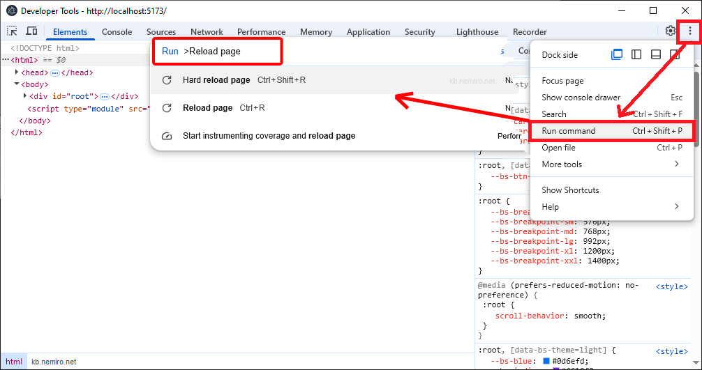

# Debugging

:::warning
This document has been translated using machine translation without human review.
:::

## How to open developer tools (DevTools)?

To open developer tools in an **Electron** application, press the `F12` key or the `Ctrl + Shift + I` key combination in the application window.

## How to reload the application/page?

* `Ctrl + R` - normal reload
* `Ctrl + Shift + R` - hard reload

## How to execute any command in developer tools?

Three dots => Run command (`Ctrl + Shift + P`).

In the window that appears, enter the name of the command you want to execute.



## How to configure debugging in VS Code for electron-vite?

```json title="./vscode/launch.json"
{
  "version": "0.2.0",
  "configurations": [
    {
      "name": "Debug Main Process",
      "type": "node",
      "request": "launch",
      "cwd": "${workspaceRoot}",
      "runtimeExecutable": "${workspaceRoot}/node_modules/.bin/electron-vite",
      "windows": {
        "runtimeExecutable": "${workspaceRoot}/node_modules/.bin/electron-vite.cmd"
      },
      "runtimeArgs": ["--sourcemap"],
      "env": {
        "REMOTE_DEBUGGING_PORT": "9222"
      }
    },
    {
      "name": "Debug Renderer Process",
      "port": 9222,
      "request": "attach",
      "type": "chrome",
      "webRoot": "${workspaceFolder}/src/renderer",
      "timeout": 60000,
      "presentation": {
        "hidden": true
      }
    }
  ],
  "compounds": [
    {
      "name": "Debug All",
      "configurations": ["Debug Main Process", "Debug Renderer Process"],
      "presentation": {
        "order": 1
      }
    }
  ]
}
```
