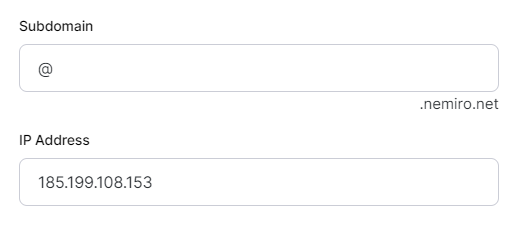
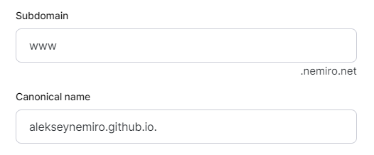
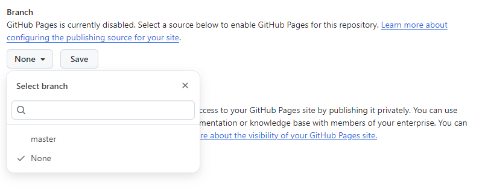
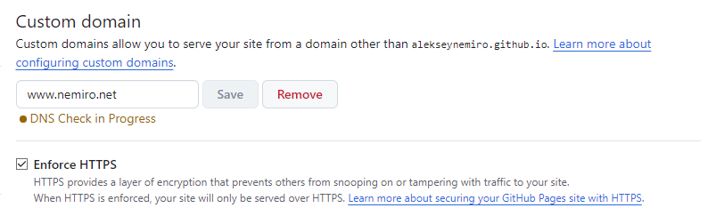

---
tags:
  - GitHub Pages
  - GitHub
  - Step-by-Step
---

# GitHub: Pages

:::warning
This document has been translated using machine translation without human review.
:::

## How to connect a custom domain?

1. Configure DNS at the DNS hosting level:
   * Create an `A` record. Use `@` or an empty string. Check the [current list of IP addresses](https://docs.github.com/ru/pages/configuring-a-custom-domain-for-your-github-pages-site/managing-a-custom-domain-for-your-github-pages-site#configuring-an-apex-domain).

    ```plain
    185.199.108.153
    185.199.109.153
    185.199.110.153
    185.199.111.153
    ```

    

    * Create a `CNAME` record targeting `username.github.io`.

    

2. Open Settings => Pages
   * Select a branch.
     
   * Add `CNAME` to the "Custom domain" section and click Save.
   * Wait for the verification results.
   * Set the "Enforce HTTPS" option when it becomes available.
     
   * If the domain is unavailable for a long time (several hours), try removing it from **GitHub** and configuring it again.
