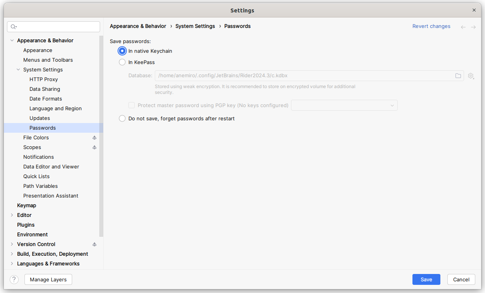

# JetBrains Rider: Settings

:::warning
This document has been translated using machine translation without human review.
:::

## How to reset git password?

1. Simply disable password saving and restart **Rider**.
2. Perform any operations that require **Git** password input.
3. Enable password saving.

`File | Settings | Appearance & Behavior | System Settings | Passwords`

