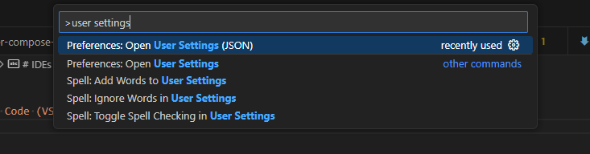

# User settings (JSON)

:::warning
This document has been translated using machine translation without human review.
:::

## How to open the user settings file in JSON format?

`Ctrl + Shift + P` => Preferences: Open User Settings (JSON)



## How to enable/disable auto-save?

```json
"files.autoSave": "onFocusChange",
```

## How to set the line break character?

```json
"files.eol": "\n",
```

## How to enable trailing whitespace removal?

```json
"files.trimTrailingWhitespace": true,
```

## How to prevent trailing whitespace removal in Markdown files?

```json
"[markdown]": {
    "files.trimTrailingWhitespace": false
},
```

## How to remove yellow highlight around Russian letters (Unicode characters)?

Add the `ru` locale to the list of allowed locales:

```json
"editor.unicodeHighlight.allowedLocales": {
    "_os": true,
    "_vscode": true,
    "ru": true
}
```

Or add specific characters to the `allowedCharacters` list:

```json
"editor.unicodeHighlight.allowedCharacters": {
    "а": true, "б": true, "в": true, "г": true, "д": true,
    "е": true, "ё": true, "ж": true, "з": true, "и": true,
    "й": true, "к": true, "л": true, "м": true, "н": true,
    "о": true, "п": true, "р": true, "с": true, "т": true,
    "у": true, "ф": true, "х": true, "ц": true, "ч": true,
    "ш": true, "щ": true, "ъ": true, "ы": true, "ь": true,
    "э": true, "ю": true, "я": true,
    "А": true, "Б": true, "В": true, "Г": true, "Д": true,
    "Е": true, "Ё": true, "Ж": true, "З": true, "И": true,
    "Й": true, "К": true, "Л": true, "М": true, "Н": true,
    "О": true, "П": true, "Р": true, "С": true, "Т": true,
    "У": true, "Ф": true, "Х": true, "Ц": true, "Ч": true,
    "Ш": true, "Щ": true, "Ъ": true, "Ы": true, "Ь": true,
    "Э": true, "Ю": true, "Я": true
}
```

Or simply disable this functionality (not recommended):

```json
"editor.unicodeHighlight.ambiguousCharacters": false
```
