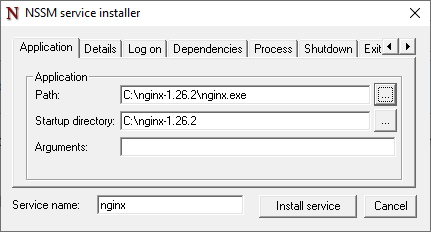

# Installing NGINX on Windows as a service

:::warning
This document has been translated using machine translation without human review.
:::

1. [Download NGINX](https://nginx.org/en/download.html)
2. `choco install nssm`
3. `nssm install nginx`
4. 
5. Enjoy!

## How to restart the service?

```bash
net stop nginx && net start nginx
```
