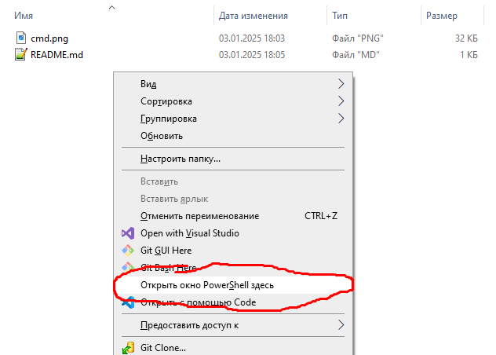

# Windows Command Prompt

:::warning
This document has been translated using machine translation without human review.
:::

## How to open Command Prompt in any folder?

Simply type `cmd` in the Explorer address bar:


If you hold the `Shift` key and right-click anywhere, you can launch **PowerShell**:



## How to set an environment variable? (only for current session)

```bash
set VAR_NAME=VALUE
```

## How to get the hostname of the current machine?

```bash
hostname
```

## How to create a symbolic link?

```bash title="Syntax"
mklink LINK_PATH TARGET_PATH
```

```bash title="Example"
mklink  "C:\Program Files\nodejs" "C:\nvm\v18.16.0" 
```

## How to view the current DNS cache?

```bash title="View cache"
ipconfig /displaydns
```

```bash title="Clear cache"
ipconfig /flushdns
```

## How to find all substrings in command output?

```
dir | findstr git
```

## How to launch Windows Event Log?

```bash
eventvwr
```

## How to check if a specific port is occupied?

```bash
netstat -na | find "8080"
```

## How to restart a service?

```bash
net stop nginx && net start nginx
```
