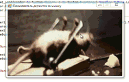

# Moment of mouse

Determining movement of the mouse cursor.

## Target

http://kbyte.ru/ru/Forums/Show.aspx?id=17469

## Requirements

* Visual Studio 2010 or later
* .NET Framework 4.0

## Tags 

VB.NET, Visual Basic .NET, Windows Forms, mouse

## Release

2015-04-15

## License

The MIT License (MIT)

Copyright © 2015, Aleksey Nemiro