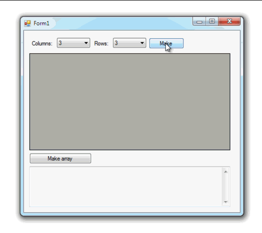

# Dynamic DataGridView

Example dynamically build **DataGridView** and receive an array from the rows and columns of the **DataGridView**.

## Target

http://kbyte.ru

## Requirements

* Visual Studio 2010 or later
* .NET Framework 3.5

## Tags 

VB.NET, Visual Basic .NET, Windows Forms, DataGridView, Controls, Dynamic, Arrays

## Release

2013-07-24

## License

The MIT License (MIT)

Copyright © 2013, Aleksey Nemiro